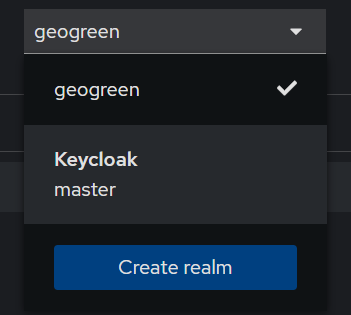
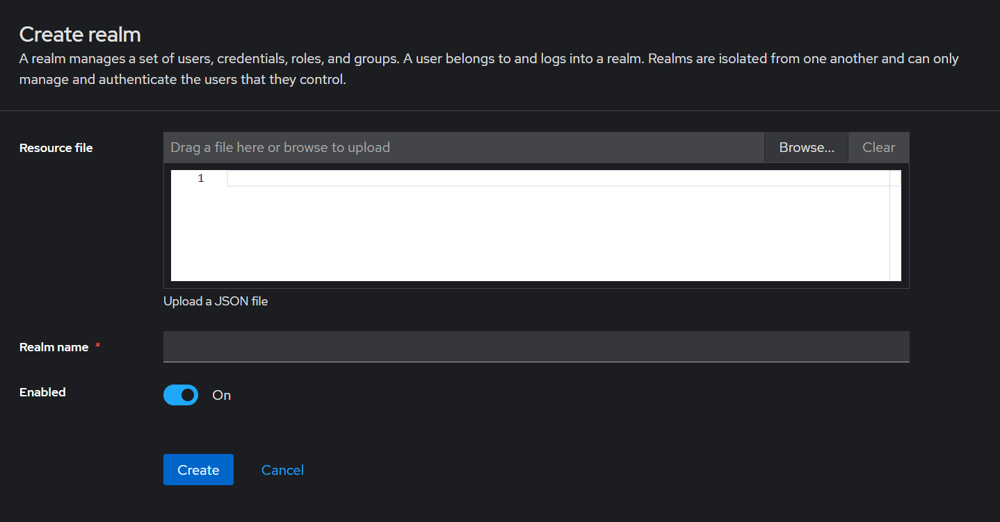
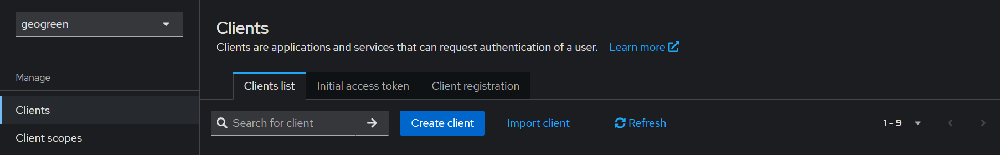
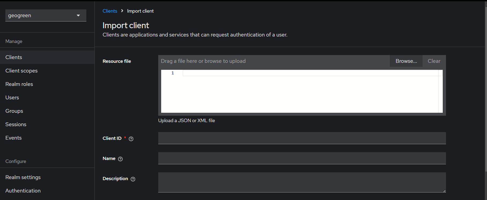
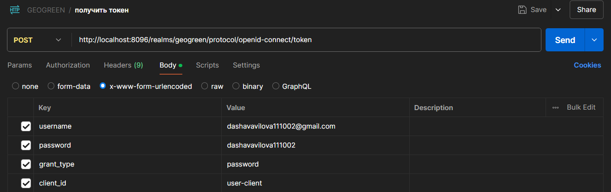

## Как создать realm

Загрузить файл `realm-export.json` и в поле `Realm name` написать `geogreen`  

## Как создать client

Загрузить файл `user-client.json` и в поле `Client ID` написать `user-client` 

## Запросить токен 
